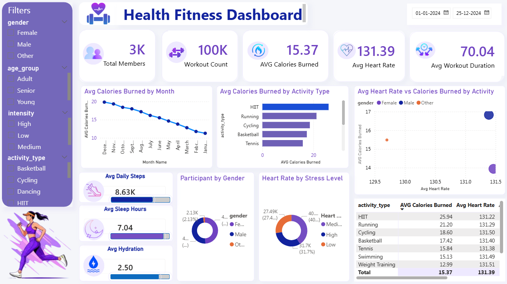

# 🏋️ Health & Fitness Dashboard

## 📌 Overview
An interactive Power BI dashboard built to analyze health and fitness data. The dashboard provides insights into workout performance, calories burned, BMI, heart rate, sleep patterns, stress levels, and overall fitness trends.

## 🛠 Tools Used
- Power BI
- Excel
- DAX

## 📂 Dataset
The dataset contains nearly 100,000 health and fitness records, including:
- Age & Gender
- Activity Type
- Calories Burned
- Daily Steps
- BMI
- Heart Rate
- Sleep Hours
- Stress Level
- Hydration Level
- Blood Pressure
- Fitness Level

## 📈 Key Features
- Fitness Performance Analysis
- Activity & Workout Tracking
- Calories Burned Insights
- BMI Distribution Analysis
- Heart Rate Monitoring
- Sleep & Stress Analysis
- Daily Steps Tracking
- Interactive Filters and Visualizations

## 📷 Dashboard Preview

## 🚀 Project Files
- Health_Fitness_Project.pbix
- health_fitness_dataset.xlsx
- README.md

## ⭐ Conclusion
This dashboard transforms raw health and fitness data into actionable insights, helping users understand fitness trends, activity patterns, and overall wellness performance.
